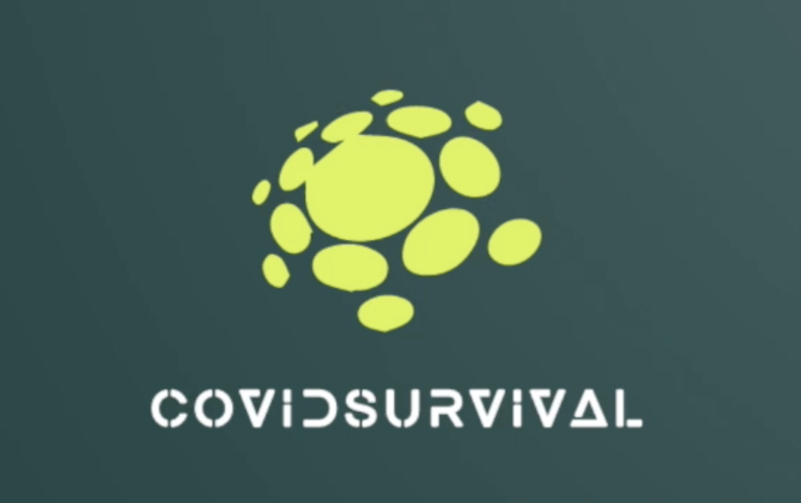

___

 ## What is ***CovidSurvival***

Do you feel boring when isolating alone? Do you want to hear stories from abroad?   
We have songs and wine, and especially, friends from all over the world to share their stories of life under quarantine.  

Do you wondering how to survival in this post COVID world?  
Check if you want to travel. There's travelling policy for each country  
Check if you fear of cases. There's real time statistics of each country  
Check if you feel alone. There's people around the world sharing and supporting each others  

We are waiting for you!

**Click to see our introduction [video](https://www.youtube.com/watch?v=jRbCMJ7fJa8)**

## Introduction

As the Covid-19 epidemic spreads around the world, the virus continues to evolve, which severely affects people's lives around the world. According to UK government figures, there have been over 4.4 million confirmed cases of coronavirus in the UK alone and more than 127,000 people have died. The epidemic is a world-wide problem that has forced people from numerous disciplines to find ways of containing the spread of the virus. 

The issue that our project seeks to address is the lack of diverse ways of presenting COVID information to users. Governments have opted to provide information about the virus to the population mainly through television broadcasts and news media. This is understandable given that these traditional media appear more appropriate for official statements as they are well-established and the information from these sources is generally perceived as more credible. However, the nature of these media does not allow them to provide a large volume of statistical information to the target audience and the content often includes directives for people about the best ways of protecting themselves. This has the disadvantage that such media are rarely able to help people make their independent observations about the spread of the virus.

That is why we decided to create  CovidSurvival - a website platform that provides statistical information about the COVID situation in each country as well as providing links to news articles and official travel policies issued by the respective governments. On our webpage users can see real-time coronavirus statistics from around the world. This has the utility of providing a source of large volumes of data. We are hoping that people who wouldn't otherwise be convinced by news articles about scientific matters would convince themselves of the accuracy of scientific claims by observing trends in the data. For example, if cases drop sharply in countries that adopted wide vaccination programmes that would attest for the efficacy of vaccines and users could be more inclined to accept this stance if they are able to infer this themselves from the data itself.   

But CovidSurvival is actually more than just a website for information! It is also a social platform that allows users to engage with each other and to share their opinions. Users are able to make forum posts and the website encourages socialising between users by giving points for likes and maintaining a leaderboard of top users. The points that count towards a user’s ranking are , however, also generated by exploring statistical information from the website and this educates users in a fun and casual way whilst also providing them a platform to socialise at a time when so many people are stuck at their homes. Also, by interacting between each other, users can share information with people who wouldn't otherwise have access to the information that others have. They can also get different points of view about the virus and the best ways of preventing infection.

## Video

**If you want to see more ->[full introduction video](https://www.youtube.com/watch?v=tdEkIdn4zNo)**

## Product design

**View our [product design document](resource_report/ProductDesign.md) to see**

- User Requirement
  - Apply the requirements finding techniques
  - User Story
  - General User Persona
- Design Process and Early prototyping and Ideation
- Wireframes and interaction flow diagrams
- UX approach
- Appendix: Interview

## System implementation

**View our [system implementation document](resource_report/SystemImplementation.md) to see :**

- Stack architecture and system design
- Back End
- Middle Tier
- Frontend implementation 
  - Frontend Overview 
  - Framework – React + Redux
    - React
    - Redux
    - Data Visualization - react-svg-map
    - UI Design – Ant-Design
- Additional elements and components
  - Authentication
  - Sound
  - Animation
- Deployment details
  - ui
    - build environment
    - production environment
  - api
  - mongo
  - docker-compose.yml

## Project Management

**View our [project management document](resource_report/ProjectManagement.md) to see :**

- Introduction
- Individual Contribution
- Risk Management
- Planning
  - Time Estimating
  - Work Breakdown
  - Gantt Chart
- Team use of Git
  - Planning
  - Developing
  - Evaluation
- Appendix : Sprint
- Manage team's tasks with Asana

## Evaluation

**View our [evaluation document](resource_report/Evaluation.md) to see :**

- Evaluation Method
- Testing
  - Frontend Test
    - Library Used
    - Testing Design
  - Backend Test
- User acceptance testing
  - Methods
    - Think aloud methods
    - Interview
  - Timeline

## Conclusion

Considering that this was the first time we had applied software engineering development methods to a project, we were very careful in our communication. Firstly, we held meetings two to three times a week to ensure that the project is developed steadily and consistently. Secondly, we used an online management platform, [Asana](resource_report/ProjectManagement.md/#Manage-team's-tasks-with-Asana), to distribute tasks between team members and to manage deadlines. We used this software to follow up on the progress of each person's tasks and adapt the expected timeframes for the completion of different features. These activities allowed us to keep in close contact and communicate issues in a timely manner, thus enabling agile development.

By comparing the list of features (backlog) drawn up at the beginning of the project based on user requirements, we have completed our project according to plan. In the backlog, we have prioritised the features for the different iterations in order of priority. This helped us to iterate through the versions in order of importance, and ultimately to create a more complete prototype. According to our plan, all the basic functionality should have been implemented in iteration 2. However, at the time of submission, we had completed the third iteration, and the prototype was much more feature-rich and interesting than the previous version.

Coronavirus has forced us to choose to work remotely, but we have planned ahead for this. In order to ensure that we can keep in touch with each other during remote collaboration, we ensure that there are two or more ways of contacting each other. For example, excluding teams, members can communicate with each other via wechat, whatsapp, etc. In extreme cases we can also meet offline to deal with unforeseen situations, that is, to meet each other face-to-face by knowing each other's address. However, we still regret that we did not have the opportunity to have a real face-to-face stand up meeting.

In terms of design, we need more usability testing to tweak the user interface and interaction story, and we can refer to more UI design methods to increase user stickiness. In terms of development, in addition to the features mentioned in the backlog for subsequent iterations, algorithms can be applied to our product. For example, the home page can be used to recommend content that may be of more interest to users based on the algorithm. In terms of evaluation, we can further deepen our evaluation tools from two perspectives. For example, code testing can be done using other open-source tools and inviting people not involved in development to black-box test the prototype. For user testing, we can use data collection techniques such as eye-movement technology to obtain statistical data for quantitative analysis. Finally, with respect to the ethical implications of the project we dont consider the website to have negative impact. A potential issue in this regard is the fact that the website only provides links to information or statistical information obtained by third-party API’s and ,therefore, the accuracy of the information is not verified. However, nowhere in the website we make claims about the accuracy of the information and users are mainly redirected to third party sources, therefore, no negative ethical implications from this.
