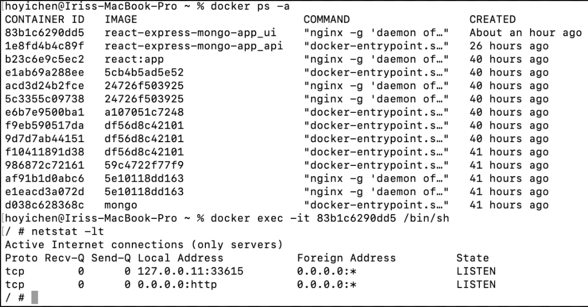

### Run up compose (DB+API+UI)

`docker-compose up `

### Run up compose with rebuilded image

`docker-compose up --build`
Do it when you updated something.

### Tutorials for backend

https://itnext.io/dockerize-a-node-js-app-connected-to-mongodb-64fdeca94797

### Tutorials for Front-end

https://itnext.io/dockerize-a-react-app-with-node-js-backend-connected-to-mongodb-63740fc0f9e7

#### backend

-   `cd api`
-   `docker build -t mongo-app .`

##### for local development

`node server.js`

##### request issue

https://stackoverflow.com/questions/41955103/cant-get-post-data-using-nodejs-expressjs-and-postman

#### frontend

-   `cd ui`
-   `docker build -t react:app .`

-   `docker run -p 3000:3000 react:app`
    only works when Dockerfile:

```
FROM node:8
# Create app directory
WORKDIR /usr/src/app
# Install app dependencies
COPY package*.json ./

RUN npm install --silent
# Copy app source code
COPY . .

#Expose port and start application
EXPOSE 3000
CMD ["npm", "start"]

```

##### for local development

`yarn start`

### Auth tutoril AMAZING!!

https://bezkoder.com/node-js-mongodb-auth-jwt/

After initializing Mongoose, we don’t need to write CRUD functions because Mongoose supports all of them:

-   create a new User: object.save()
-   find a User by id: User.findById(id)
-   find User by email: User.findOne({ email: … })
-   find User by username: User.findOne({ username: … })
-   find all Roles which name in given roles array: Role.find({ name: { $in: roles } })

### Q>WebSocket connection to 'ws://localhost:3000/sockjs-node' failed:

Ａ：
make port 3000:80

[14:07] Marceli Wac
So the problem was essentially just mapping the wrong port on the ui service container. I debugged this by connecting to the running container (after running docker-compose up ) with the following:

`docker exec -it <container_id> /bin/sh`
and then checked what ports are actually exposed:

`netstat -lt`

which showed 0.0.0.0:http a.k.a port 80.


[15:28] Marceli Wac
run `docker ps -a`
​[15:29] Marceli Wac
Because the nginx server is running on port 80, so the port you have to expose is port 80. Then all you do is bind that to port 3000 (or whatever you want)

#### How to get docker container ID

`docker ps -a`

---

## other reference

### login

-   with SQL
    https://www.w3jar.com/node-js-login-and-registration-system-with-express-js-and-mysql/
