

# Product Design

## Table of Contents

- [**User Requirement**](#user-requirement)
  - [Apply the requirements finding techniques](#Apply-the-requirements-finding-techniques)
  - [User Story](#user-story)
  - [General User Persona](#general-user-persona)
- [**Design Process and Early prototyping and Ideation**](#Design-Process-and-Early-prototyping-and-Ideation)
- [**Wireframes and interaction flow diagrams**](#Wireframes-and-interaction-flow-diagrams)
- [**UX approach**](#UX-approach)
- [**Appendix: Interview**](#appendix-interview)

## User Requirement

### **Apply the requirements finding techniques**

**Background Reading**

For background reading, we found some relevant documentation manuals for similar projects. These documentations help us to establish a general understanding of the system. And we attempted to get an overview of the review procedures and general requirements of a similar system.

**Interviewing**

Interviewing is the technique that has been used most widely to obtain the requirements, and it’s a simple way for us to communicate with people face to face. We had one–to–one interviews with some friends who study or work in countries all over the world. 
The interview question can be seen in [Appendix: Interview](#appendix-interview).

**Questionnaire**

In this section, we produced some special questions which can help to gather and capture the indeed needs of our software end-users. The questionnaire can be seen in [Appendix: Interview](#appendix-interview).

**Observation**

Observation is also one of the methods of the Fact-finding technique. Observing customers who are using the social platforms(ex. Twitter, Facebook, etc.) can provide us with a better understanding of the system to be designed and developed. From several times of observations of some social platforms and combining the result of the interviewing, we have some inspiration in product design with new ideas about attracting potential users and increasing retention. 

### User Story

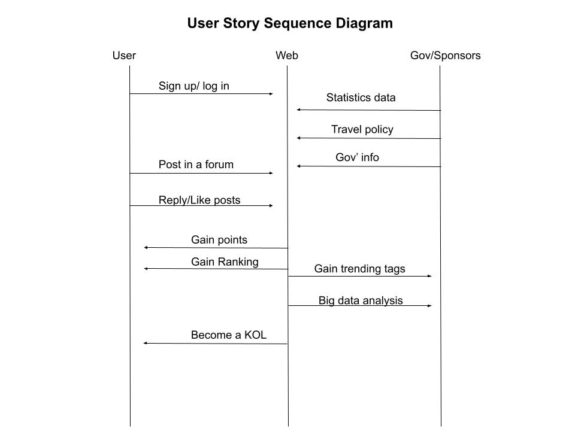
  
Click [Backlog](Backlog.md) to see User Story and iteration arrangement.

### General User Persona

After analyzing the data collected from 56 potential users, we try to give a basic user persona.

Age : Under 30

Occupation : Student

Living habit : Frequent computer user. Plenty of spare time

Interests: Sharing life with strangers. Interested in world news

Characteristics: Expect socialising. Not familiar with foreign countries. Not used to reading world news. Afraid of being alone. Enjoys being followed by others.

User environment : Forced to stay at home for long periods of time because of the spread of the coronavirus. 

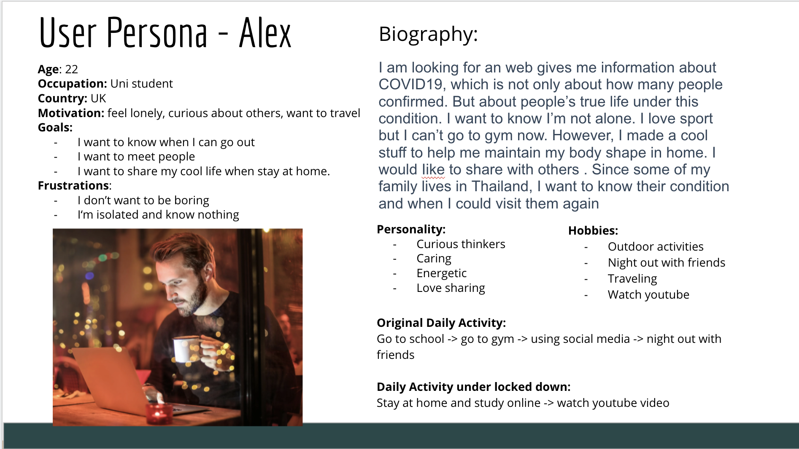

## Design Process and Early prototyping and Ideation

- Mood Board

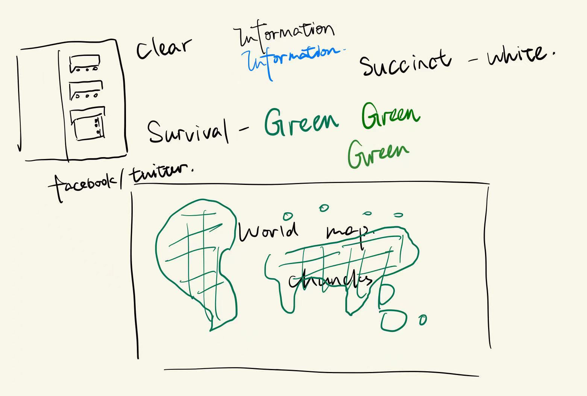

- Paper Prototyping

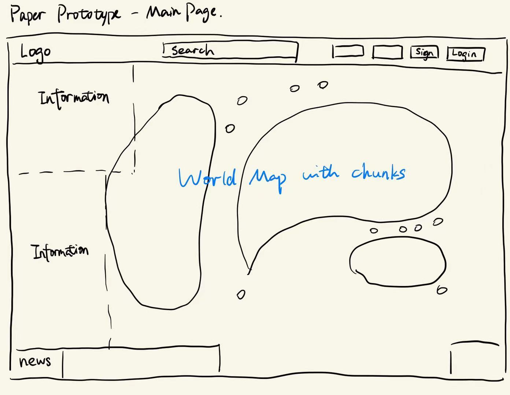
  

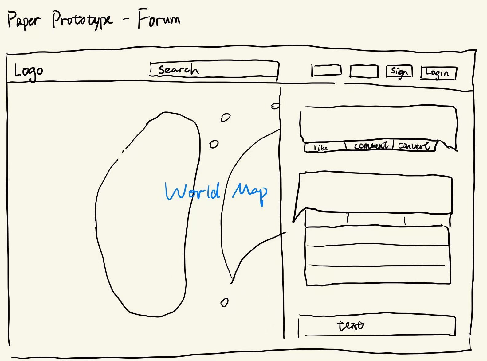
  

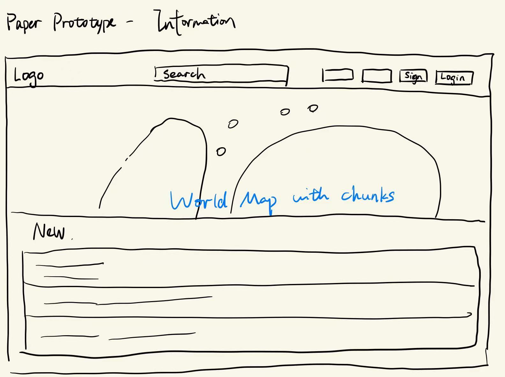

## UX approach

Heuristic evaluation is a method in the field of UX for assessing the usability of products. Throughout the design and development process, we try to do heuristic evaluations of the latest iteration of the prototype as often as possible. The following heuristic analysis scales are used.

|                 **Heuristic Content**                  | **Severity** | **Records**                                                  |
| :----------------------------------------------------: | :----------: | ------------------------------------------------------------ |
| Visibility of system status and loss of mobile devices |      0       | Always keeping the user informed of what is happening.       |
|         Matching of the system to user habits          |      1       | Use of words, phrases and concepts that are familiar to the user rather than system-oriented terminology |
|                Consistency and mapping                 |      2       |                                                              |
|   Ease of input, screen readability and swipeability   |      3       |                                                              |
|   Flexibility, efficiency of use and personalisation   |      3       |                                                              |
|       Aesthetics, privacy and social conventions       |      3       |                                                              |
|             Handling of exceptions, errors             |      3       |                                                              |

## Wireframes and interaction flow diagrams

Original prediction game and map wireframe design for desktop UI (up), and updated with forum wireframe design (down):

- Prototype of the main page

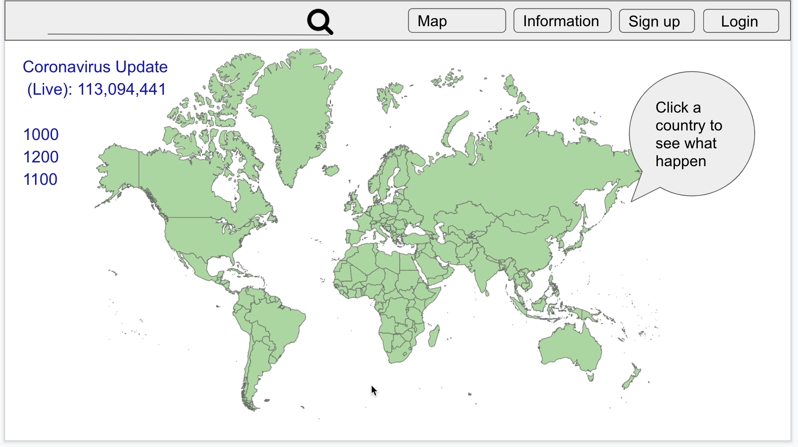

- Prototype of the news, gov’s info and travel policy

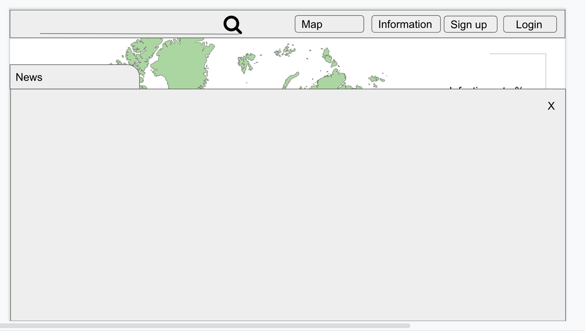

Because of ethical issue, we finally modified our product. We add new game system with socail interaction like forum and likes, and added more information not only about official unumbers of covid but also trending tags and hot words.

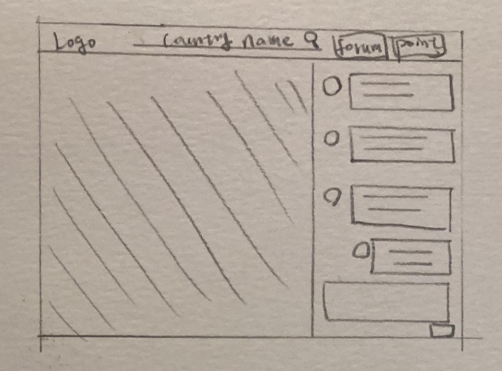

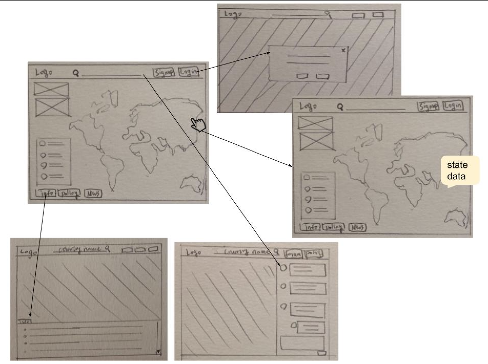

We want to make our product more friendly, after interviewed many users and collect their feedback, it’s necessary for us to add introduction and tutorial in the begining.

- Prototype of the intro page

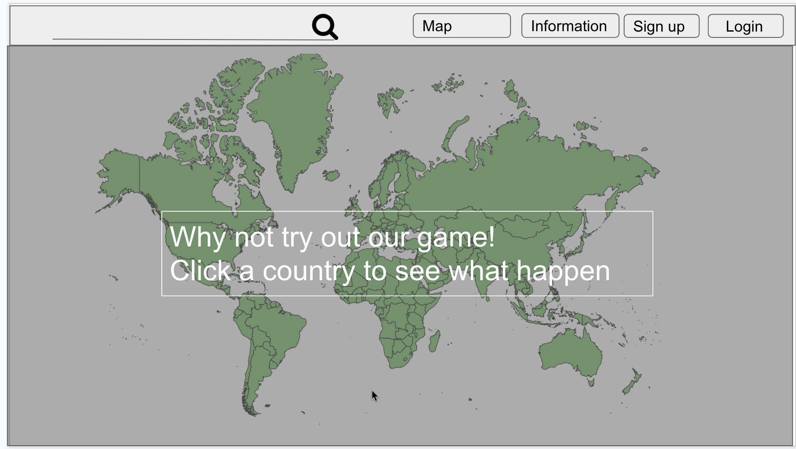
- Original prediction game and map wireframe

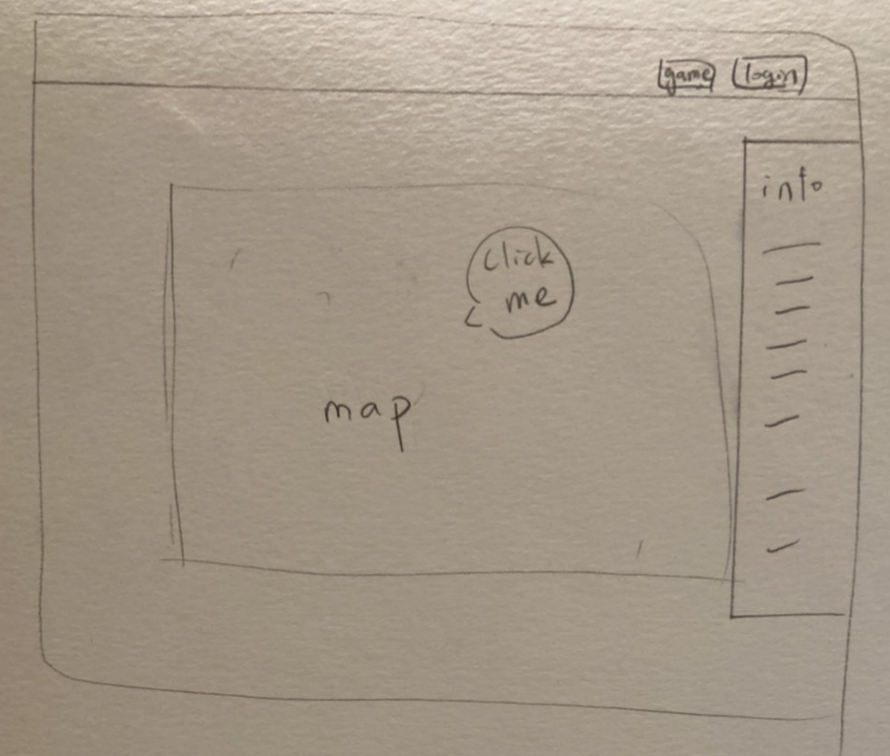

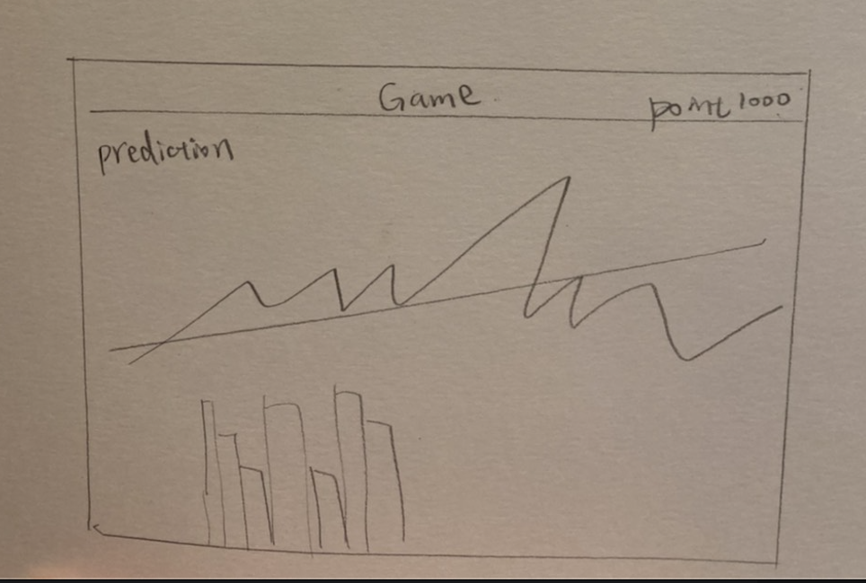

------

- updated with forum wireframe

We picked a world map to attract users to click and search the current situation of other country, and decided a one page ui to simplify data and tasks and to avoid switching different functionalities in the other pages.

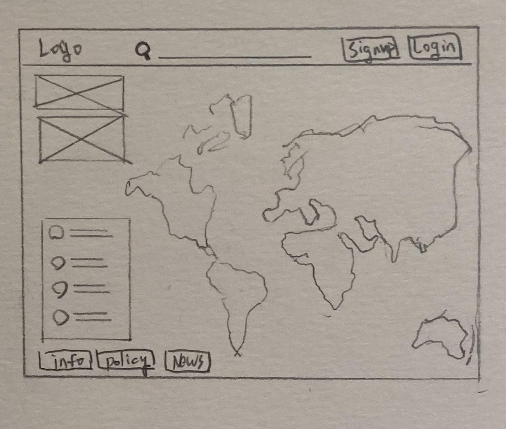

#### Interaction flow diagrams for final key subsystems

Map is the key feature for our product so we choose destoop ui for this project. In the future, mobile version will be considered since it may encourage user to use forum and socail interaction frequently.

- User journey flow
  - Without authentication, the user could view government infomation, travel policy, news, ranking of users’ points, official covid statistics and trending words statistics by clicking map and switching to the other country.
  - With authentication, the user could collect points by post, like, reply in the forum or click map to check the data of other countries.

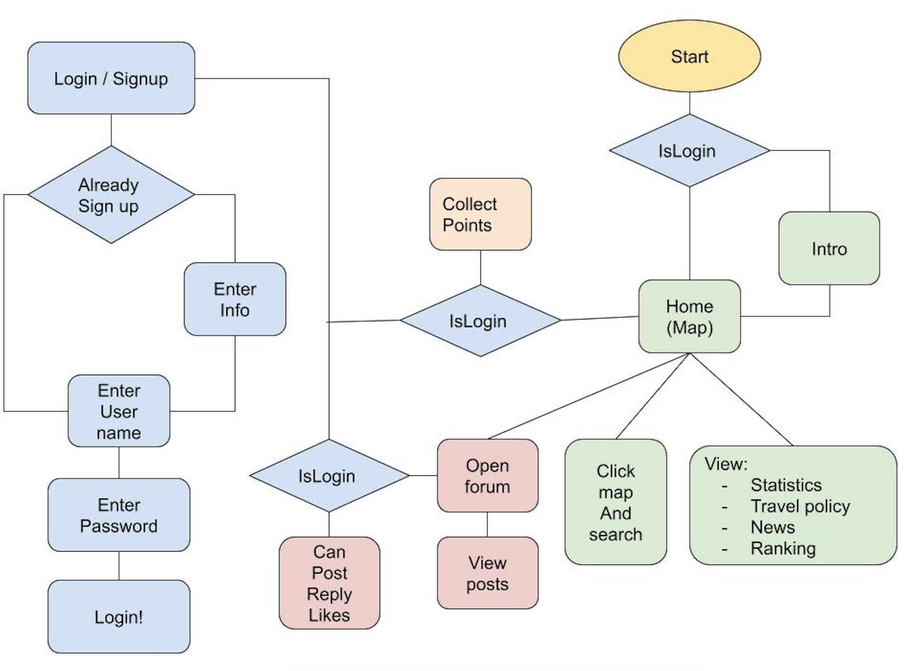

## Appendix Interview

1. To what extent do you think you understand the current situation in the world 

   Mark : 1 - 9

2. To what extent do you think you are aware of the current transmission of the coronavirus in countries around the world

   Mark : 1 - 9

3. To what extent do you think you know how to protect yourself from the coronavirus?

   Mark : 1 - 9

4. If there was a social networking platform where people around the world shared their lives in the face of coronavirus transmission, how long would you spend each day visiting the page?

   (Time Duration)

5. Would you be willing to share your life with your online friends about your life with the spread of the coronavirus?

6. For what purpose would you use the page?
   
7. Is there anything in particular you would like to know about coronavirus?
