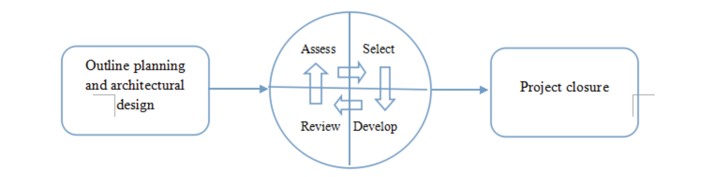
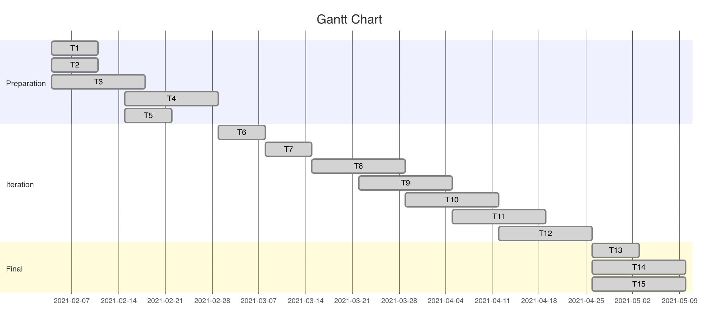
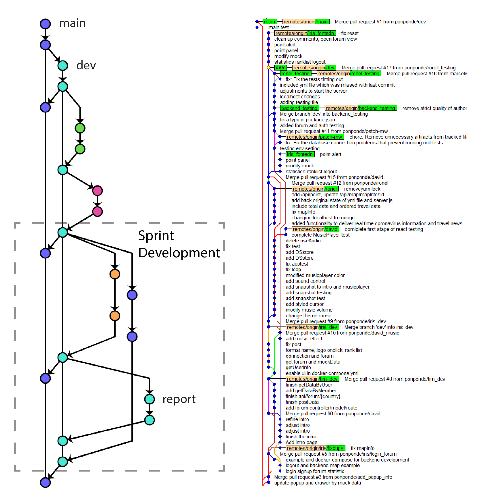
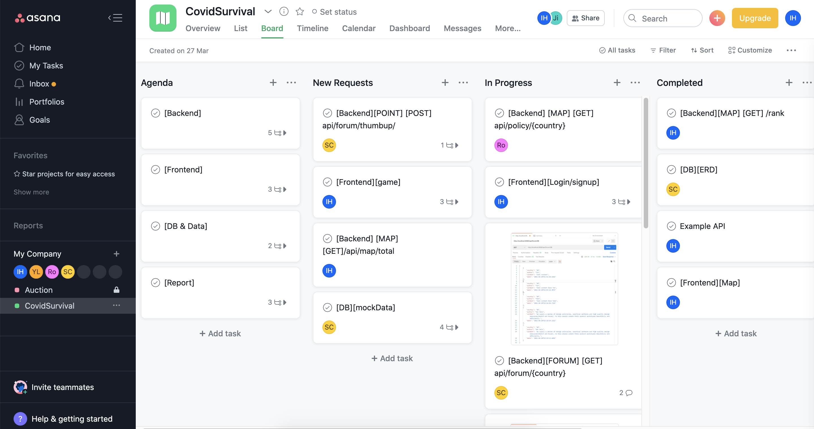
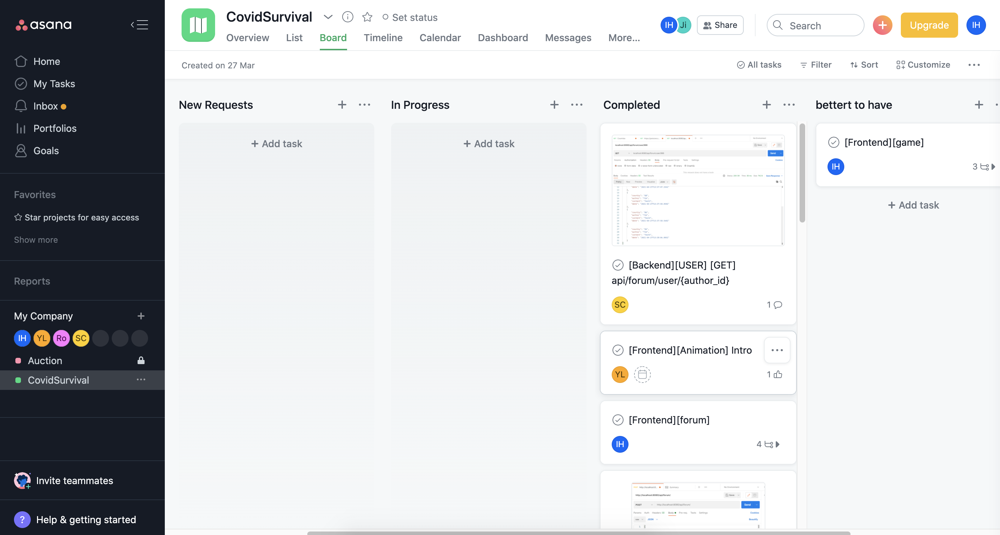

# Project Management

## Table of Contents

- [**Introduction**](#introduction) 
- [**Individual Contribution**](#individual-contribution)
- [**Risk Management**](#risk-management)
- [**Planning**](#planning)
  - [Time Estimating](#Time-Estimating)
  - [Work Breakdown](#work-breakdown)
  - [Gantt Chart](#gantt-chart)
- [**Team use of Git**](#team-use-of-git)
	- [Planning](#Planning)
	- [Developing](#Developing)
	- [Evaluation](#Evaluation)
- [**Appendix : Sprint**](#appendix-sprints)
- [**Manage team's tasks with Asana**](#Manage-team's-tasks-with-Asana)

## Introduction

To make our project flexible, we used Agile which is a set of best practices in software development based on Scrum, Extreme Programming and Lean. Agile also requires a different approach, which is adapted to incremental development and the particular strengths of agile methods.

We mainly used the Scrum approach which is a general Agile method but its focus is on managing iterative development rather than specific agile practices. There are three core phases in Scrum including making the outline planning, planning the series of sprint cycles and closure phase. More details about the sprint cycle information and so on can be acquired from [**Appendix : Backlog**](Backlog.md).

The reason why we choose Scrum as our core method is that the clear process helps us to plan the whole work and to divide them into several stages. The project of CovidSurvival is broken down into a series of the manageable and understandable chunks so that it becomes much easier for our team to reach an agreement on the detail of the project requirement. Also, unstable requirements can never hold up the process. Through several stand-up meetings, the whole team can have visibility of everything which helps us to keep the same pace and share the information about the schedule and existing problem.

For example, as a project facing to the user all aroung the world, end users can easily participate in the whole developing process, which gives us a convenient channel to obtain the feedback, so that later increments can be successfully conducted based on end users’ evaluation. Besides, to make the project to be easy enough to use, the System user interfaces are developed using an interactive development system with pictures and a few animations in order to prove the end users’ engagement.

## Individual Contribution

|       Name        |                         Email                         | Responsibility  |
| :---------------: | :---------------------------------------------------: | --------------- |
|     Jiayi Wu      | [kz20196@bristol.ac.uk](mailto:kz20196@bristol.ac.uk) | Project Manager |
|  Ronel Mehmedov   | [yu20919@bristol.ac.uk](mailto:yu20919@bristol.ac.uk) | Coder           |
| Sheng-Han Tim Chu | [re20470@bristol.ac.uk](mailto:re20470@bristol.ac.uk) | Coder           |
|    Yi-Tsen Ho     | [kv20880@bristol.ac.uk](mailto:kv20880@bristol.ac.uk) | Leader          |
|    Yin-Te Lan     | [oq20204@bristol.ac.uk](mailto:oq20204@bristol.ac.uk) | Coder           |

## Risk Management

| **Possible Risks**                                           | **Risk Type**             | **Occurrence Possibility** | **Solutions**                                                |
| ------------------------------------------------------------ | ------------------------- | -------------------------- | ------------------------------------------------------------ |
| A member is ill or non-available circumstances               | People                    | Medium                     | Dynamically adjust personnel tasks in terms of unforeseen    |
| Difficult to integrate all projects from sub-groups due to different configurations | Tools                     | High                       | Unified development environment and commit code regularly for test |
| Computer crashed                                             | Tools                     | Medium                     | Use Github and store regularly                               |
| Inefficient allocation of team work leads to low efficiency  | Organizational            | Low                        | In early stage, task allocation should be in detail and task load should be well estimated. |
| Low quality code can result in needless test and re-code repeatedly | Design and Implementation | Medium                     | Before committing code, one of member for sub-group need to review the code in advance. |
| The requirements have not been fully analyzed.               | Requirements              | Medium                     | In early stage, we need take sufficient time for requirement analysis, and when designing, any change for requirements should be discussed if it is necessary. |

## Planning

A Work Breakdown Structure is used to separate a large and sophisticated project into simpler, controllable and independent tasks.

The Gantt Chart is a traditional tool to represent the timing of tasks.

Those will help us to arrange and manage tasks when developing project more efficiently.

### Time Estimating

|    **Items**     |        **Time**        | Task                                                         |
| :--------------: | :--------------------: | ------------------------------------------------------------ |
| Outline planning | Feb 4th - April 10th | Establish the general objectives and design the software structure. |
|   Sprint cycle   |  April 9th - May 3rd   | Plan the backlog, select the function to be complete and write the code. |
| Project closure  |   May 3rd -May 10th    | Wraps up the project and complete required documentation.    |

### Work Breakdown

A Work Breakdown Structure is used to separate a large and sophisticated project into simpler, controllable and independent tasks.

The Gantt Chart is a traditional tool to represent the timing of tasks.

Those helped is to arrange and manage tasks when developing project more efficiently.

| **Stage**   | **Activity**                                         | **Durations** | **Dependencies** | **Deliverables**            |
| ----------- | ---------------------------------------------------- | ------------- | ---------------- | --------------------------- |
| Preparation | T1. Sketch for objective restricts and risk analysis | 1             |                  |                             |
|             | T2. Identify member allocation                       | 1             |                  | Schedule                    |
|             | T3. Write stories and prioritize them                | 2             |                  | Stories                     |
|             | T4. Product backlog                                  | 2             | T3               | Backlog                     |
|             | T5. Paper prototype user interface                   | 1             |                  | Prototype                   |
| Iteration   | T6. Adjust functions                                 | 1             | T4               |                             |
|             | T7. Estimation and iteration plan                    | 1             | T6               |                             |
|             | T8. Identify and design API                          | 2             | T7               |                             |
|             | T9. Assign the tasks                                 | 2             | T8               |                             |
|             | T10. Development                                     | 2             | T8, T9           |                             |
|             | T11. Implementation                                  | 2             | T10              | Code                        |
|             | T12. Test and Review                                 | 2             | T11              | Project and Test Feedback   |
| Final       | T13. Adjust the interface to make more friendly      | 1             | T5               |                             |
|             | T14. Test and Review                                 | 2             | T12, T13         | Project and Test Feedback   |
|             | T15. Finish the final report                         | 2             | T14              | Final report for submission |

### Gantt Chart

## Team use of Git

In this project, we use Git and GitHub to manage and cooperate on all of our codes and reports. In order to keep everything tidy and to practice continuous integration and deployment, Gitflow workflow is used to set up a neat but also robust framework for managing collaborative projects.

### Planning
Before starting to develop our product, we have discussed several times in our weekly meetings to establish:

- Personal workflow (including usage of Git command)
- Branching rules
- Pull request
- Branch protection rules
This ensures all of our members have a consensus on how to develop locally and remotely at the same time. Building developing rules before starting to develop could benefit in separating tasks and environments, debugging and finding historic version especially in sprint development where dozens of commits will be pushed to remote every day.

Our Git repository has main, dev, feature and report branches. The main branch, which is merged from the dev branch, stores a stable version of our project and should pass all the tests. Dev branch, which is an integration branch of features, serves as our primary working branch and any feature must branch from dev. To prevent accidentally changing main and dev, branch protection rules are set so members cannot push to these branches directly. Instead, we use pull requests when there is a need to merge to main or dev. Feature branches are created when someone wants to add or adjust code. After finishing the development work on the feature branch, the member should create a pull request to dev and others can help to test the functionality. Once other members have reviewed the change, the feature can be merged to the dev branch. The report branch is made to cooperate on our final report. Finally, we made a diagram to illustrate our workflow therefore we can stick to the plan easier.

### Developing
During development, we found that it’s hard to keep everything to the plan. Because this is the first time we collaborate using Git, we sometimes forgot to git fetch before creating feature branches. Furthermore, we were not sure when to merge to dev and main and what kind of tests should be applied before the merge. The solution is that every member builds the project during weekly meeting and tests together if there is any problem. Then we merge those finished feature branches. In this case, we keep the working tree clean and members can easily track changes of each commit.

Sometimes bugs appear after merging, however, with this developing routine, we can simply git reset and try to merge manually to verify if every conflict was solved correctly.

### Evaluation
Because Git has many advantages like speed, simplicity and integrity, using git as our version control tool definitely facilitates our project development. Although we did not stick to the Gitflow at all times and we messed the working tree occasionally, our project is maintained well by this version control system.

There is still something we can improve on using Git. First, each member should be more familiar with Git commands and the version control system. Therefore, we will not need to spend a huge amount of time fixing disordered branches and solving issues in the individual local repository. Second, we should follow Gitflow as possible to keep main, dev, and feature branches doing their works. As a result, the working tree will be more straightforward and easier to maintain and release. Last but not least, everyone should make clearer commit messages so that others could understand at a glance. People don’t really have the patience to look into every commit and check changes in files. This is especially important when there are hundreds of commits in the repository.

## Appendix Sprints
#### Sprint 1: Brainstorming

- Key meeting points:
  - ideas
  - motivations
  - Five project proposals

- Reflections
  - not sure which one we can complete with time
  - need more survey

#### Sprint 2: Estimate development scope and core function

- Key meeting points:
  - survey result1: usable third party api for covid data
  - survey result2: map component for angular and react
  - Decision of the topic of our project
  - Decision: MongoDB, Express, React, Node.js + Docker

- 	Reflections
   - Can't find a sutible map component of angular
   - find a supervisor for react

#### Sprint 3: Define architecture & interactions & first prototype

- Key meeting points:
  - Agreed on overall infrastructure . 
  - Defined minimum viable product (MVP). 
  - Decide a basic UI interface mockup.
  
- Reflections
  - gaming system?

#### Sprint 4 : Alpha version release 

- Key meeting points:
  - frontend with mock data
  - Ethical issue: should we change or gaming system?
  - Replace prediction game by forum and point system

#### Sprint 5 : Beta version release 

- Key meeting points:
  - Key function: authorization, map, forum
  - additional feature: statistics , ranking list with mock data

#### Sprint 6 : Auto testing & Version 1.0 release 

- Key meeting points:
  - build backend testing by mockgoose, supertest and chai for testing api's request and response.
  - build frontend testing 

#### Sprint 7 : Resolving issues and enhancing features & Write-up

- Key meeting points:
  - point system

## Manage team's tasks with Asana

1. With Asana, we created tickets, which contains api spec and description, in the requirement block and assigned a member to each ticket. 

2. As our sprints go, the tickets will be moved to the progress or complete block. 
   -  members could create subtask based on their tickets.

3. At the end, all the tasks should in the completec block besides those which is good to have for this stage but could be put into the next stage in the future.

