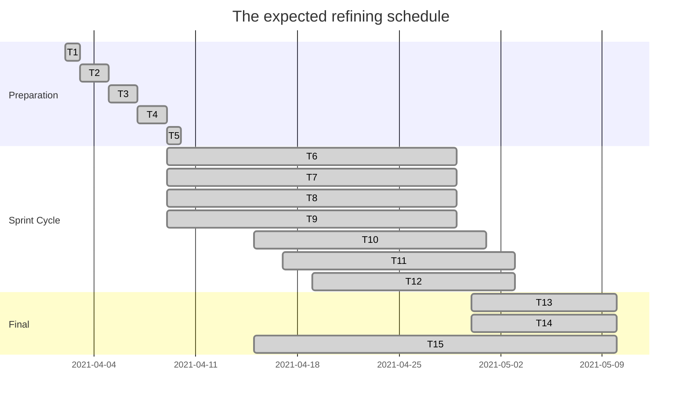

# Project Management

## Table of Contents

- [**Introduction**](#introduction) 
- [**Individual Contribution**](#individual-contribution)
- [**Risk Management**](#risk-management)
- [**Planning**](#planning)
  - [Time Estimating](#Time-Estimating)
  - [Work Breakdown](#work-breakdown)
  - [Gantt Chart](#gantt-chart)
- [**Team use of Git**](#team-use-of-git)
- [**Appendix : Sprint**](#appendix-sprints)
- [**Appendix : Backlog**](#appendix-backlog)

## Introduction

For our flexible and extensible project, we use Agile which is a set of best practices in software development based on Scrum, Extreme Programming and Lean. Besides, Agile also requires a different approach, which is adapted to incremental development and the particular strengths of agile methods.
We mainly use the Scrum approach which is a general Agile method but its focus is on managing iterative development rather than specific agile practices. There are three core phases in Scrum including making the outline planning, planning the series of sprint cycles and closure phase. More details about the sprint cycle information and so on can be acquired from [**Appendix : Backlog**](#appendix:backlog).

The reason why we choose Scrum as our core method is that the clear process helps us to plan the whole work and to divide them into several stages. The project of CovidSurvival is broken down into a series of the manageable and understandable chunk so that it becomes much easier for our team to reach an agreement on the detail of the project requirement. Also, unstable requirements can never hold up the process. Through several stand-up meetings, the whole team can have visibility of everything which helps us to keep the same pace and share the information about the schedule and existing problem.

For example, as a project facing to the user all aroung the world, end user can easily participate in the whole developing process, which gives us a convenient channel to obtain the feedback, so that later increment can be successfully conducted based on end users’ evaluation. Besides, to make the project to be easy enough to use, the System user interfaces are developed using an interactive development system with pictures and a few animations in order to prove the end users’ engagement.

## Individual Contribution

|       Name        |                         Email                         | Responsibility  |
| :---------------: | :---------------------------------------------------: | --------------- |
|     Jiayi Wu      | [kz20196@bristol.ac.uk](mailto:kz20196@bristol.ac.uk) | Project Manager |
|  Ronel Mehmedov   | [yu20919@bristol.ac.uk](mailto:yu20919@bristol.ac.uk) | Coder           |
| Sheng-Han Tim Chu | [re20470@bristol.ac.uk](mailto:re20470@bristol.ac.uk) | Coder           |
|    Yi-Tsen Ho     | [kv20880@bristol.ac.uk](mailto:kv20880@bristol.ac.uk) | Leader          |
|    Yin-Te Lan     | [oq20204@bristol.ac.uk](mailto:oq20204@bristol.ac.uk) | Coder           |

## Risk Management

| **Possible Risks**                                           | **Risk Type**             | **Occurrence Possibility** | **Solutions**                                                |
| ------------------------------------------------------------ | ------------------------- | -------------------------- | ------------------------------------------------------------ |
| A member is ill or non-available circumstances               | People                    | Medium                     | Dynamically adjust personnel tasks in terms of unforeseen    |
| Difficult to integrate all projects from sub-groups due to different configurations | Tools                     | High                       | Unified development environment and commit code regularly for test |
| Computer crashed                                             | Tools                     | Medium                     | Use Github and store regularly                               |
| Inefficient allocation of team work leads to low efficiency  | Organizational            | Low                        | In early stage, task allocation should be in detail and task load should be well estimated. |
| Low quality code can result in needless test and re-code repeatedly | Design and Implementation | Medium                     | Before committing code, one of member for sub-group need to review the code in advance. |
| The requirements have not been fully analyzed.               | Requirements              | Medium                     | In early stage, we need take sufficient time for requirement analysis, and when designing, any change for requirements should be discussed if it is necessary. |

## Planning

A Work Breakdown Structure is used to separate a large and sophisticated project into simpler, controllable and independent tasks.

The Gantt Chart is a traditional tool to represent the timing of tasks. (see appendix[1])

Those will help us to arrange and manage tasks when developing project more efficiently.

### Time Estimating

|    **Items**     |        **Time**        | Task                                                         |
| :--------------: | :--------------------: | ------------------------------------------------------------ |
| Outline planning | April 2nd - April 10th | Establish the general objectives and design the software structure. |
|   Sprint cycle   |  April 9th - May 3rd   | Plan the backlog, select the function to be complete and write the code. |
| Project closure  |   May 3rd -May 10th    | Wraps up the project and complete required documentation.    |

### Work Breakdown

A Work Breakdown Structure is used to separate a large and sophisticated project into simpler, controllable and independent tasks.

The Gantt Chart is a traditional tool to represent the timing of tasks. (see appendix[1])

Those will help us to arrange and manage tasks when developing project more efficiently.

| **Stage**    | **Activity**                                         | **Durations** | **Dependencies** | **Deliverables**            |
| ------------ | ---------------------------------------------------- | ------------- | ---------------- | --------------------------- |
| Preparation  | T1. Sketch for objective restricts and risk analysis | 1             |                  |                             |
|              | T2. Identify member allocation                       | 1             |                  | Schedule                    |
|              | T3. Write stories and prioritize them                | 2             |                  | Stories                     |
|              | T4. Product backlog                                  | 2             | T3               | Backlog                     |
|              | T5. Paper prototype user interface                   | 1             |                  | Prototype                   |
| Sprint Cycle | T6. Adjust functions                                 | 1             | T4               |                             |
|              | T7. Estimation and iteration plan                    | 1             | T6               |                             |
|              | T8. Identify and design API                          | 2             | T7               |                             |
|              | T9. Assign the tasks                                 | 2             | T8               |                             |
|              | T10. Development                                     | 2             | T8, T9           |                             |
|              | T11. Implementation                                  | 1             | T10              | Code                        |
|              | T12. Test and Review                                 | 2             | T11              | Project and Test Feedback   |
| Final        | T13. Adjust the interface to make more friendly      | 1             | T5               |                             |
|              | T14. Test and Review                                 | 2             | T12, T13         | Project and Test Feedback   |
|              | T15. Finish the final report                         | 4             | T14              | Final report for submission |

### Gantt Chart

## Team use of Git

## Appendix Sprints

#### Sprint 1: Brainstorming

- Key meeting points:
  - ideas
  - motivations
  - Five project proposals

- Reflections
  - not sure which one we can complete with time
  - need more survey

#### Sprint 2: Estimate development scope and core function

- Key meeting points:
  - survey result1: usable third party api for covid data
  - survey result2: map component for angular and react
  - Decision of the topic of our project
  - Decision: MongoDB, Express, React, Node.js + Docker

- 	Reflections
   - Can't find a sutible map component of angular
   - find a supervisor for react

#### Sprint 3: Define architecture & interactions & first prototype

- Key meeting points:
  - Defined and agreed on overall infrastructure .
  - Defined minimum viable product (MVP) with functions/classes/variables.
  - Defined interactions between subsystems including a first iteration of the request types and their JSON syntax.
  - Decide a basic UI interface mockup for admin user story.

- Reflections
  - gaming system?

#### Sprint 4 : Alpha version release 

- Key meeting points:
  - frontend with mock data
  - Ethical issue: should we change or gaming system?
  - Replace prediction game by forum and point system

#### Sprint 5 : Beta version release 

- Key meeting points:
  - Key function: authorization, map, forum
  - additional feature: statistics , ranking list with mock data

#### Sprint 6 : Auto testing & Version 1.0 release 

- Key meeting points:
  - build backend testing by mockgoose, supertest and chai for testing api's request and response.
  - build frontend testing 

#### Sprint 7 : Resolving issues and enhancing features 

- Key meeting points:
  - point system

#### Sprint 8 : Write-up

## Appendix Backlog

这里麻烦参考我之前发在群里的那个报告的附件10.

| Story ID | Story Name                           | Description                                                  | Priority | Iteration number | Acceptance Criteria                                          | Notes                                                        | Date started | Date finished |
| -------- | ------------------------------------ | ------------------------------------------------------------ | -------- | ---------------- | ------------------------------------------------------------ | ------------------------------------------------------------ | ------------ | ------------- |
| S01      | Map display in blocks                | As a user, I want to view the condition of each country by clicking chunks on map. | 1        | 1                | Verify that the screen can display the map while each chunk refers to a country. | 1. User can view the map without login.                      | 4/9          | 4/15          |
| S02      | Register                             | As a user, I want to register an account.                    | 1        | 1                |                                                              | 1. User should input their information include 注册需要用的信息、唯一性等等对用户的要求 |              |               |
| S03      | Login                                | As a user, I want to have a personal account which can be keeped permanently. | 1        | 1                |                                                              | 1. User should register first.   2.(加一个账号的唯一性？根据数据存储的方式？) | 4/9          | 4/15          |
| S04      | Check my account                     | As a user, I want to check my account information.           | 1        | 1                |                                                              | 1. User should first login, then view the account information. |              |               |
| S05      | Display information for each country | As a user, I want to view the information group by countries when click the chunk. | 1        | 1                |                                                              |                                                              |              |               |
| S05a     | Display information for each country | As a user, I want to view the world information when 鼠标不放在国家上？ | 1        | 1                |                                                              | 对于S05a和b的解释：a是根据国家区分提供的信息，b是不根据国家提供的信息 |              |               |
| S05b     | Display information for each country | As a user, I want to view 什么信息group by countries when 鼠标放在国家上？ | 1        | 1                |                                                              | 如果这里有不太一样的内容的话，可以拆开写。                   |              |               |
|          |                                      |                                                              |          |                  |                                                              | ⬆️note这栏可以根据技术的内容说一下你们准备做什么？（我不是很看得懂这块😭 |              |               |
| S04      | Personal  Point                      | As a user, I want to collect point by interacting with others. | 2        |                  |                                                              |                                                              |              |               |
| S04a     | Personal  Point                      | As a user, I want to own the initial point  at the beginning. | 2        |                  | The users may got 300 points when register.                  |                                                              |              |               |
| S04b     | Personal  Point                      | As a user, I want to collect point by gambling, comment, sending messages and agree on other's comment . | 2        |                  | When the users gamble, or comment on other's message, sending messages, or aggree on other's message, the point increase. |                                                              |              |               |
| S04c     | Personal  Point                      | As a user, I want to collect point by commenting, sending messages and agree on other's comment . | 2        |                  | When the users comment on other's message, sending messages, or aggree on other's message, the point increase. **The function of gambling was dropped due to ethical reason.** |                                                              |              |               |
| S        | Interaction interface beautification | As a user, I want 这边除了鼠标变成了个啥之外，还做了别的么   | 3        |                  |                                                              | 这个功能对用户这里有什么要求么                               |              |               |
| S        | Tutorial                             | As a user, I want to have a tutorial that can show me how to interact with this website. | 3        | 3                | Verify that the user who is the first time to be here would get a guidance. |                                                              | 4/25         | 5/5           |
