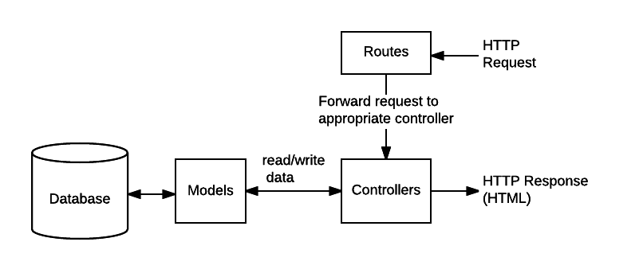
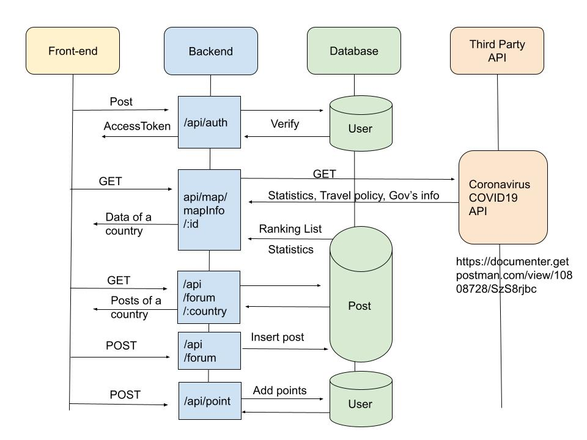
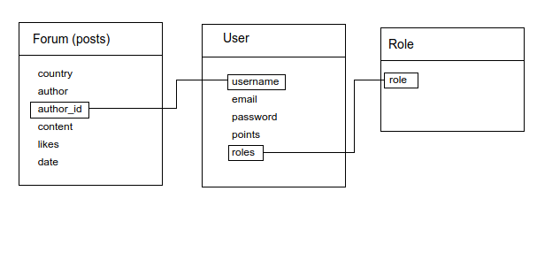

<p align="center">

  

# System Implementation

## Table of Contents

- [Stack architecture and system design](#Stack-architecture-and-system-design)
- [Back End](#Back-End)
- [Middle Tier](#Middle-Tier)
- [Frontend implementation](#Frontend-implementation)
  - [Frontend Overview](#Frontend-Overview)
  - [Framework–React/Redux](#Framework–React/Redux)
    - [React](#React)
    - [Redux](#redux)
    - [Data Visualization](#Data-Visualization)
    - [UI Design](#UI-Design)
- [Additional elements and components](#Additional-elements-and-components)
  - [Authentication](#Authentication)
  - [Sound](#Sound)
  - [Animation](#Animation)
- [Deployment details](#Deployment-details)
  - [ui](#ui)
    - [build environment](#build-environment)
    - [production environment](#production-environment)
  - [api](#api)
  - [mongo](#mongo)
  - [docker-compose.yml](#docker-compose.yml)


## Stack architecture and system design

**Stack Architecture**

The website implements the MERN stack architecture. React was chosen to develop for the front end of the website. The main reason for this is the fact that the team’s objective was to develop a website that features an interactive world map where countries could be clicked to provide information and space for forum posts. We discovered a publicly available React library which implemented the functionality that we wanted to provide and it was considered that using React to integrate this library would be more efficient than using Angular to re-implement all the components necessary for the map.

Moreover, React provides greater flexibility with respect to the design of the website. Whilst Angular mandates the use of Model-View-Controller design pattern, the same design can be implemented with React but is not required. During the planning stage of the project the team was considering the option of using json files for persistent storage of data and relying on a simpler design pattern for the website. Whilst a similar design pattern was ultimately followed in the development process, the flexibility of having alternative options was considered an advantage in the beginning of the project. 

For the back-end, the website relies on Node js to execute javascript on the server side. Node is the preferred choice because it allows the user to start a basic server without a significant amount of time being spent on environment configuration. 

Express was used to define routes and make calls to third party API’s where necessary.  The framework allows request information to be parsed and to set response codes and custom information containing objects. Because the developed website is a single page application, all content for display is generated by React and Express is only used to serve the necessary data and static files. 

MongoDB was used for persistent storage of data for the website. MongoDB is a NoSQL database that allows us to structure data as objects and documents as opposed to tables with rows and columns. The advantage of this is that we don't have to convert or map the objects from the code into tables with specific relationships.


**System Design**

The code for the website is designed into UI and API, which contain the code for the front end and back end side of the website respectively.

<p align="center">

In API, server.js is used to start the server which connects the website’s database to the user interface.  The file establishes a connection to MongoDB and adds the routes of the website’s API to the middleware to be executed when different endpoints are reached by the user. The website’s design follows the Model-View-Controller design pattern but instead of static templates being rendered as views, those are generated dynamically by React on the front end. Thus, there are dedicated files which contain the information about the models of the data and ,separately , files that execute javascript to process data fetched from the database and return the processed information back to the user. This process occurs when a user selects the appropriate button/field on the interactive map which is routed to a particular URL serving as an endpoint. Once the appropriate field is clicked, this prompts a request to the server’s API which processes information depending on which endpoint is reached. The processing logic is contained in the controller files. The controllers are, in turn,  connected to the server’s endpoints through the routes defined with Express in api/routes folder. The diagram below illustrates the way data is handled by the API:

<p align="center">

In UI the key files are the components which provide JavaScript functionality in a reusable way. The HTML that is returned from these files is exported through the containers/Home/index.js file which provides the initial layout for the page and handles clicks and other functionality needed by the user. 

## Back End

MongoDB and Mongoose were used for database implementation.  MongoDB is a NoSQL database program which uses documents akin to JSON and schemas to store data, it is developed by MongoDB Inc. and licensed under the Server Side Public License (SSPL) .  Mongoose on the other hand is a tool that is used for modelling data into schemas. 

The setup for the mongoose connection is defined in api/db/index.js and the models are defined in api/db/models. Each of the files in the latter folder defines a mongoose schema that is used to map the data stored in MongoDB. Below is a map illustrating the relationship between the models used for the website:

<p align="center">


The data received from third party API’s for statistical information about COVID is not being stored as it’s being simply redirected to the user through the map.controller.js.


## Middle Tier

The back end implements a RESTful API. The data is shared between the front end and the back end through http requests and the data that is exported from the back end is in JSON format as opposed to the strict requirement for XML documents with SOAP for example. Through CRUD operations, data is accessed by the front end through HTTP requests and visualised to the end user. The persistence of the server and the routes from the API to the front end are implemented through Node and Express.

The main files for the API are detailed below.

**/config**

Contains configuration files that export keys required for authentication

**/routes**

This folder contains the route files that are used in server.js to connect the front end to the controller files

**/package.json**

This file contains information about the project’s dependencies and scripts  and is used by the Dockerfile when the server is run.

**/controllers**

The files in this folder contain the code that receives http requests and according to the endpoint they perform different logic and export different data fetched from the database

auth.controller.js handles three separate but connected functionalities. This controller allows the server to save new users and their information to the server. It does so by obtaining the necessary information to create a user by taking the data from the route parameters sent with the request and saving them to the database. Similarly, the controller also handles authentication when a user presses ‘login’ -  this part of the code deals with the verification of the user and throws an appropriate error message if information is provided that does not reconcile with the database. Finally, the controller also allows user information to be obtained.

The user.controller.js has the sole functionality of exporting information about the number of likes a given post receives in one of the forums. This information is obtained by adding the existing points with the additional points defined in the request received.

The forum.controller.js allows data to be posted and retrieved from forums for countries. This part of the code is also responsible for sorting the results before they are displayed. Individual information about members can also be extracted through this controller.

The map.controller.js deals with displaying statistical information about covid cases in separate countries. Once a country is clicked, this controller contacts a third party API through axios and fetches the relevant information. Because the returned response contains daily data, the controller parser the information for the current day only and sends the information to the front end. 

### API Spec

API spec is on [swagger](https://app.swaggerhub.com/apis-docs/covidsurvival/covid-survival/1.0), which will be expired on 05/22/2021 on swagger free pages. 
If it is expired, please refer to [Yaml](resource_report/covidSurvival.v1.yaml) or [Html](resource_report/covidSurvivalApiSpec.html) 

<p align="center">

We designed six APIs as below:

#### [POST] Sign up
   - Purpose: user registration
   - Request body:
```
{
  "username": "abc5",
  "email": "abc5@gmail.com",
  "password": "12345"
}
```
#### [POST] Sign in
   -  Purpose: user login
   - Request body:
```
{
  "username": "abc5",
  "password": "12345"
}
```
   - Response body:
```
{
  "id": "608aa1cc309675001a015c98",
  "username": "abc5",
  "email": "abc5@gmail.com",
  "roles": [
    "ROLE_USER"
  ],
  "accessToken": "eyJhbGciOiJI......IaOHFhKJTbu00"
}
```
   - Extension in the future: we plan to give each roles different authorization. 
For example, an admin of a country's forum or levels according to users poins and ranking.  

#### [GET] /api/map/mapInfo/:id
**:id** is country's id. 
When the user clicks a country on the map, the front-end will fetch this api for information of that country inclouds: 
   - The numbers of cases: backend will fetch `https://api.covid19api.com/live/country/` and get realtime data.
   - Travel policy: backend will fetch `https://api.covid19api.com/premium/travel/country/` and get updated data.
   - Gov's info: we plan to collect each country's official website links and posters about fighting COVID like:
   <p align="center">

   -  Ranking (Mock): This array contains the top 5 users' information about points but now is just mock data. 
   -  Statistics (Mock): This shows the trending tags goes up and down in that country. Now is mock data ,but in the future, we are going to develop emotion and sentiment analysis based on posts in a country's forum.
   - News (TBC): We plan to search news about covid of that country, but we have not completed this service this time.

```
{
  "Country": "Global",
  "CountryCode": "Global",
  "Confirmed": 149407874,
  "Deaths": 3148318,
  "Recovered": 86817042,
  "Active": "",
  "Recommendation": "",
  "Notes": "",
  "NewConfirmed": 661727,
  "statistics": {
    "up": {
      "title": "Cooking by myself",
      "rate": "52.1%"
    },
    "down": {
      "title": "Jogging",
      "rate": "6.82%"
    }
  },
  "rankList": [
    {
      "points": 11685,
      "name": "Eyrdin",
      "photo": "https://www.tubefilter.com/wp-content/uploads/2019/11/dobrik-people-1920x1131.jpg"
    },
    ...
    {
      "points": 1804,
      "name": "Eyrdin",
      "photo": "https://api.time.com/wp-content/uploads/2021/04/self-love.jpg"
    }
  ]
}
```


#### [POST] /api/point

User could add points by clicking map by chance,posting in a forum, replying a post or like a post.

- Request body
```
{ "id": "608aa1cc309675001a015c98", "points":3 }

```
- Response body
```
{
  "id": "608aa1cc309675001a015c98",
  "points": 303
}
```
We did not finish this part at the time, but it should be completed as soon as possible.

#### ​[POST] /api​/forum
Make a post in the forum:
- Request body
```
{
  "country": "GB",
  "author": "Han Solo",
  "author_id": "608aa1cc309675001a015c98",
  "content": "We supply a series of design principles, practical patterns and high quality design resources(Sketch and Axure), to help people create their product prototypes beautifully and efficiently."
}
```

#### [GET] /api/forum/:country
When an user clicks forum, front-end will fetch this api and get posts of the forum.
- Response body
```
[
  {
    "country": "string",
    "author": "string",
    "author_id": "string",
    "content": "string",
    "likes":"number"
  }
]
```
- Extension: 
   - Each post sould contain reply posts.
   - It should allow users upload photo, voice message and video.
## Frontend implementation 

### Frontend Overview 

We implemented our webpage frontend with some libraries and some well-built Html components. Generally, our main implement methods and libraries used can be shown in Table 1.  


Table 1. Frontend libraries overview

### Framework–React/Redux

#### React

React is an open source JavaScript library for building user interfaces maintained by Facebook. It lets you compose complex UIs from small and isolated pieces of code called “components”[1]. In mechanism, it features virtual document object model, which only rendered the components actually change.

There are plenty of frontend frameworks nowadays. The most popular ones are the big three - Angular, React, and Vue. We finally chose React for our project not only because of its popularity but also its outstanding advantages[2].  

First, popularity, According the research by Elar Saks[3],  react has the highest package downloads which means that the resources must be sufficient to do a good project. We indeed found a perfect react-svg-map[4] for our data visualization  and a fantastic UI library ant-design[5].Second, in React it's easy to make separate components. Our components are contained in the components folder, like figure 1. Third, simplicity, well defined methods, HTML like in-javascript tags for component rendering, and a full CSS support make the user learn quickly with some basic frontend skills. We arranged our components like Figure 2.  The fourth reason is testability - with a bunch of testing library[6][7][8] and components structure React web app is very easy to test.


```
├── ui
│   ├── public
│   ├── src
│   │   ├── components
│   |   │   ├──Editor
│   |   │   ├──InfoDrawer
│   |   │   ├──Intro
│   |   │   ├──LoginModal
│   |   │   ├──MusicPlayer
│   |   │   ├──NavBar
│   |   │   ├──Post
│   |   │   ├──RankingList
│   |   │   ├──Reply
│   |   │   ├──SideForum
│   |   │   ├──SignupModal
│   |   │   └──StatisticPanel
│   │   ├── containers
│   │   ├── data
│   │   ├── Endpoint
│   │   ├── img
│   │   ├── music
│   │   ├── store
│   │   │   ├── action.js
│   │   │   ├── reducer.js
│   │   │   └── types.js
│   │   ├── utils
│   │   ├── common.scss
│   │   ├── index.scss
│   │   └── index.js
│   ├── Dockerfile
│   └── package.json
├── docker-compose.yml
└── README.md*
```

Figure 1. Frontend Structure


```
├──Intro
│   ├──__test__
│   ├──index.js
│   └──intro.scss
```

Figure 2. Frontend Component structure

#### Redux

Because of the components structure of React, the states of each will become very hard to maintain through the growth of the scale of the web application. Hence, we need a library to help us manage the states. Redux[9], a predictable state container for JS Apps, is perfect for this job.

To use Redux, we also need a UI binder to support Redux. We chose an official library React-Redux[10] to do the job.


#### Data Visualization

We introduce a novel method to visualize the data in map. Because the shape of every country is not a rectangle like a typical html component or a simple shape easy to implement by css.  We reach out for a support from a ready-made react map component. We put react-svg-map into the main page of our webpage,  and combine it with the data to show. With one click , all of the data are changed to that country.


Gif 1. React-svg-map interaction


#### UI Design

To make our webpage keep a neat and nice design, We adopt Ant-Design for our UI design library. Ant-Design provides a complete program including lots of common component like buttons, modal and carousel. For example, the modal for Forum button( Gif. 2 ) and the carousel for intro tutorial( Gif. 3 ).


 
Gif 2. Forum modal


Gif 3. Carousel for intro tutorial information


## Additional elements and components

We have implemented some components with some special methods and libraries. We outline them in the following paragraph.

### Authentication

To accomplish a login function, a reliable method to do Authentication is very important. We adopted JSON Web Tokens for our login authentication. JSON Web Tokens are an open, industry standard RFC 7519 method for representing claims securely between two parties[11]. We set the login function  in the webpage to remember the JWT token of user login for 24 hours. After 24 hours, it will automatically expired. A button for logout also provided. 

### Sound

We use JavaScript to control the primitive Audio component in Html. We considered other music frameworks like Tone.js and Howler.js. However, we found that the build in Audio component is enough for our work. We implemented this in the MusicPlayer component ( Figure. 1 ). We implement whole page click sound by document.body.addEventListener() (Code 1.). Background music play by document.getElementById() (Code 2.). We create an easy toggle for play and stop of the background music (Gif 4 ). 


 ```
useEffect(() => {
         document.body.addEventListener('mousedown', soundEffect );
      return function cleanup() {
          window.removeEventListener('mousedown', soundEffect );
      } 
  },[]);
 ```

Code 1. Whole page click sound


```
useEffect(() => {
    const audio = document.getElementById("audio");
    if(audio != null){
      audio.volume = finalVolume;
      audio.loop = true;
      playing ? audio.play() : audio.pause();
    }
  });
```

Code 2. Back ground music


Gif 4. Music Toggle

### Animation

After considering some animation libraries like react-spring and Framer-motion, we decided to use the primitive @keyframe in CSS for our animation. For example our intro animation is fully implemented with  @keyframe ( Gif 5 ).


Gif 5. Intro animation


[1]    ‘Tutorial: Intro to React – React’. https://reactjs.org/tutorial/tutorial.html (accessed May 09, 2021).
[2]    ‘What And Why React.js’. https://www.c-sharpcorner.com/article/what-and-why-reactjs/ (accessed May 09, 2021).
[3]    E. Saks, ‘JavaScript Frameworks: Angular vs React vs Vue.’, 2019. http://www.theseus.fi/handle/10024/261970 (accessed May 09, 2021).
[4]    victorcazanave, ‘react-svg-map’, npm. https://www.npmjs.com/package/react-svg-map (accessed May 09, 2021).
[5]    ‘Ant Design - The world’s second most popular React UI framework’. https://ant.design/ (accessed May 09, 2021).
[6]    ‘Jest · 🃏 Delightful JavaScript Testing’. https://jestjs.io/ (accessed May 09, 2021).
[7]    ‘React Testing Library | Testing Library’. https://testing-library.com/docs/react-testing-library/intro (accessed May 09, 2021).
[8]    ‘Introduction · Enzyme’. https://enzymejs.github.io/enzyme/ (accessed May 09, 2021).
[9]    ‘Redux - A predictable state container for JavaScript apps. | Redux’. https://redux.js.org/ (accessed May 09, 2021).
[10]    ‘Why Use React Redux? | React Redux’. https://react-redux.js.org/introduction/why-use-react-redux (accessed May 09, 2021).
[11]    auth0.com, ‘JWT.IO’. http://jwt.io/ (accessed May 09, 2021).


## Deployment details

In this project, we use docker to test and deploy our product and to achieve continuous integration and deployment. We created 3 images including ui, api, and mongo and set up network for communicate to each other.

### ui

```dockerfile
#### build environment
FROM node:12.2.0-alpine as build
WORKDIR /app
ENV PATH /app/node_modules/.bin:$PATH
COPY package.json /app/package.json
RUN npm install --silent
RUN npm install react-scripts@3.0.1 -g --silent
COPY . /app
RUN yarn build

#### production environment
FROM nginx:1.16.0-alpine
COPY --from=build /app/build /usr/share/nginx/html
EXPOSE 80
CMD ["nginx", "-g", "daemon off;"]
```

The ui image deploys our frontend part of our project. We use multi-stage builds to create our ui image. First, we use the node official image to build our project including installing all modules in `package.json`. Next, since we use React as our frontend web framework, `npm install react-scripts` download scripts and configuration used by React. After setting up the environment, we then use `nginx` to deploy our server-side and listen on port 80.


### api

```dockerfile
FROM node:8
#### Create app directory
WORKDIR /usr/src/app
#### Install app dependencies
COPY package*.json ./

RUN npm install
#### Copy app source code
COPY . .

#### Expose port and start application
EXPOSE 8080
CMD [ "npm", "start" ]
```

This image is for creating multiple api and receive any request from ui image. Node official image is used as the base image and listen on port 8080. 


### mongo

Instead of creating the database image, we use the official mongo image directly pulled from the docker hub.

### docker-compose.yml

```yaml
version: '2'
services:
  ui:
    build: ./ui
    ports:
      - '3000:80'
    depends_on:
      - api
  api:
    build: ./api
    ports:
      - '8080:8080'
    depends_on:
      - mongo
  mongo:
    image: mongo
    ports:
      - '27017:27017'
```

We use `docker-compose up --build` to build our whole product including ui, api, and mongo image. Because the api container requires the service from the mongo container, we need to start the mongo container first. This is the same as ui and api container. `depends_on` is used to start containers in dependency order.

### CI/CD

   <p align="center">[12]

CI/CD allows us to release the next version efficiently. Continuous integration (CI) involves developers making changes and reviews their code. Continuous delivery (CD) automatically delivers completed code to environments. Although we are not expected to deploy this project to a remote server, we plan to build our CI/CD by these steps:
1. Start from planing and coding
2. Build and test: must pass all built testing 
3. Release and deploy: open pull request and reviewed by other members
4. Approved to merge into dev
5. Deploy to the remote server and run it up by docker (Dev environment)
6. Test the lastest version on the Dev environment
7. If we find bugs or create new requests, we go back to the first step.


[12]https://www.synopsys.com/glossary/what-is-cicd.html
